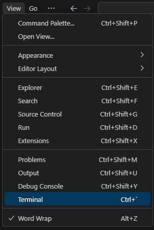
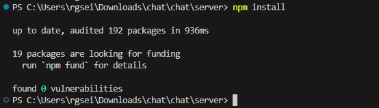
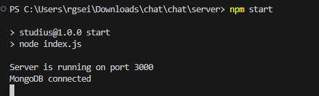
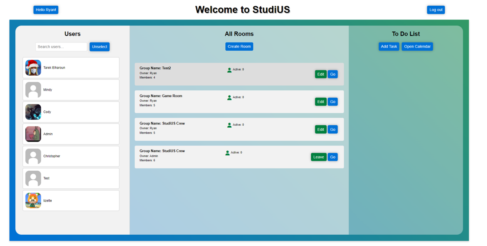

# STUDIUS

_created by Ryan, Liz, Tarek, Mindy, and Cody_

Summary:
StudiUS, a project designed for Internet Programming, was developed by our team as a web application. Aimed at university students, it allows for the creation of virtual study and game rooms where users can connect and interact. The purpose of the application was to facilitate a fun and interactive environment for students to engage with each other.

This project uses Node.js with Express Framework, and other dependencies listed below:

## Dependencies

| Dependency | Description            |
|------------|------------------------|
| Node.js    | Javascript             |
| MongoDB    | Database Access        |
| Express.js | Server Backend         |
| Socket.io  | Real Time              |
| WebRTC     | Video/Audio            |

(Note: Replace '...' with other dependencies and their descriptions)

---

### 🚨 ALERT: LOOK HERE FOR INSTRUCTIONS 🚨

1. **Open Visual Studio Code**.
2. Click on `View` and then select `Terminal`.!
   

3. In the terminal, type: `cd server`
This navigates to the `server` folder.

 

4. 🚨 MAKE SURE TO DO `npm install` 🚨 This installs all necessary packages.

5. After installation, run: `npm start` to run the development mode

5. Now ctrl + click on the http://localhost:3000 or manual type it in your browser

**You should get this page**

**Features**

- REAL TIME Video Chatting/Audio

- Create and Edit Room

- Add a Tasks

- Select Users

- Messaging

- Edit Profile Pictures 

